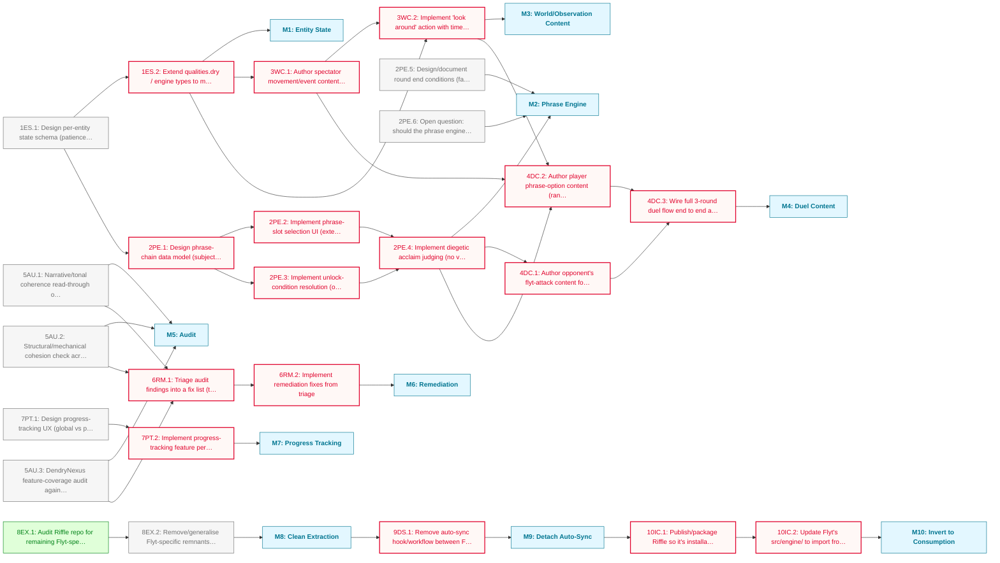

# Flyt Foundations Roadmap

Groundwork across all three areas of the project before either subgame is content-complete: the Contest flyting duel (built from scratch), a coherence audit and remediation pass on the already-built Great Hall showcase, and a clean extraction of the shared engine into the standalone Riffle repo.

**Critical path:** `1ES.1 → 1ES.2 → 3WC.1 → 3WC.2 → 4DC.2 → 4DC.3`; the Contest duel content can't be written until per-entity state, the phrase engine, and world/observation content all exist. The Riffle and Great Hall tracks are independent of Contest and of each other.

---

## Milestone 1: Entity State

**Goal:** Model per-NPC state (patience, mood, attention) for spectator entities

- [ ] **1ES.1**: Design per-entity state schema (patience, mood, attention) for spectator NPCs
- [ ] **1ES.2**: Extend qualities.dry / engine types to model per-NPC entity bundles (Thane, rival, shieldmaiden, merchant, seer, jarl, warband, shipwright) _(blocked: depends on 1ES.1)_

---

## Milestone 2: Phrase Engine

**Goal:** Build the chained phrase-slot mechanic, extending DendryNexus card mechanics, with unlock conditions and diegetic acclaim judging

- [ ] **2PE.1**: Design phrase-chain data model (subject / response-to-opponent / observed-detail slots) atop DendryNexus card mechanics _(blocked: depends on 1ES.1)_
- [ ] **2PE.2**: Implement phrase-slot selection UI (extends card/hand rendering for chained, non-reversible choices) _(blocked: depends on 2PE.1)_
- [ ] **2PE.3**: Implement unlock-condition resolution (opponent's move + observed events + player history determine available phrase options) _(blocked: depends on 2PE.1)_
- [ ] **2PE.4**: Implement diegetic acclaim judging (no visible score; world-state narrative reveals relative success/failure each attempt) _(blocked: depends on 2PE.2, 2PE.3)_
- [ ] **2PE.5**: Design/document round end conditions (fail to match prior acclaim, or fail to construct a coherent attempt)
  - Note: informs 2PE.4's judging logic; can be spec'd in parallel with 2PE.1-2PE.3
- [ ] **2PE.6**: Open question: should the phrase engine eventually live in Riffle rather than Flyt's src/engine/?
  - Note: no hard dependency on M10 (Invert to Consumption). Flagged for later reassessment, not blocking.

---

## Milestone 3: World/Observation Content

**Goal:** Author the "look around" layer: spectator movement, world events, and the time/information trade-off

- [ ] **3WC.1**: Author spectator movement/event content per zone (arrivals, departures, natural events) driving entity state over time _(blocked: depends on 1ES.2)_
- [ ] **3WC.2**: Implement "look around" action with time-cost trade-off (crowd impatience accrues per look, gated by per-entity patience from M1) _(blocked: depends on 1ES.2, 3WC.1)_

---

## Milestone 4: Duel Content

**Goal:** Author the actual 3-round flyting duel using the finished phrase engine and world content

- [ ] **4DC.1**: Author opponent's flyt-attack content for round 1-3 openers _(blocked: depends on 2PE.4)_
- [ ] **4DC.2**: Author player phrase-option content (randomly-surfaced phrases, opponent-adaptation responses, observation-derived options) referencing M3 world content _(blocked: depends on 3WC.1, 3WC.2, 2PE.4)_
- [ ] **4DC.3**: Wire full 3-round duel flow end to end and playtest (player established as laughably inept tonally throughout) _(blocked: depends on 4DC.1, 4DC.2)_

---

## Milestone 5: Audit

**Goal:** Establish the actual state of Great Hall's 94 scenes before deciding what to fix

- [ ] **5AU.1**: Narrative/tonal coherence read-through of all Great Hall content (merchants, showcase, skalds, warriors decks and hub)
- [ ] **5AU.2**: Structural/mechanical cohesion check across the 4 decks (do decks reference or affect each other; does the hub tie them together)
- [ ] **5AU.3**: DendryNexus feature-coverage audit against docs/dendrynexus-reference.md (confirm which upstream features are actually exercised by current content)
  - Note: pre-interview check already confirmed clean compile and zero dangling choice/goTo/call targets; this task goes deeper into feature coverage, not just link integrity

---

## Milestone 6: Remediation

**Goal:** Fix what the audit finds

- [ ] **6RM.1**: Triage audit findings into a fix list (tonal fixes, structural fixes, missing-feature-coverage gaps) _(blocked: depends on 5AU.1, 5AU.2, 5AU.3)_
- [ ] **6RM.2**: Implement remediation fixes from triage _(blocked: depends on 6RM.1)_

---

## Milestone 7: Progress Tracking

**Goal:** Let the player see how much Great Hall content remains

- [ ] **7PT.1**: Design progress-tracking UX (global vs per-deck, visible vs hidden, where it surfaces in the UI)
- [ ] **7PT.2**: Implement progress-tracking feature per design _(blocked: depends on 7PT.1)_

---

## Milestone 8: Clean Extraction

**Goal:** Finish pulling all engine code into the Riffle repo, with nothing Flyt-specific left behind

- [x] **8EX.1**: Audit Riffle repo for remaining Flyt-specific code/assumptions that shouldn't live there _(done)_
  - Note: findings and recommended disposition per item in docs/reports/RIFFLE_AUDIT.md
- [ ] **8EX.2**: Remove/generalise Flyt-specific remnants from Riffle
  - Note: findings and recommended disposition per item: docs/reports/RIFFLE_AUDIT.md

---

## Milestone 9: Detach Auto-Sync

**Goal:** Remove the current one-way auto-sync mechanism between Flyt and Riffle

- [ ] **9DS.1**: Remove auto-sync hook/workflow between Flyt and Riffle repos _(blocked: depends on M8)_

---

## Milestone 10: Invert to Consumption

**Goal:** Flyt installs/imports Riffle as a dependency instead of housing the engine directly

- [ ] **10IC.1**: Publish/package Riffle so it's installable (npm package, git dependency, or workspace link, method TBD) _(blocked: depends on M9)_
- [ ] **10IC.2**: Update Flyt's src/engine/ to import from Riffle instead of housing engine code directly _(blocked: depends on 10IC.1)_

---

## Dependency Diagram

